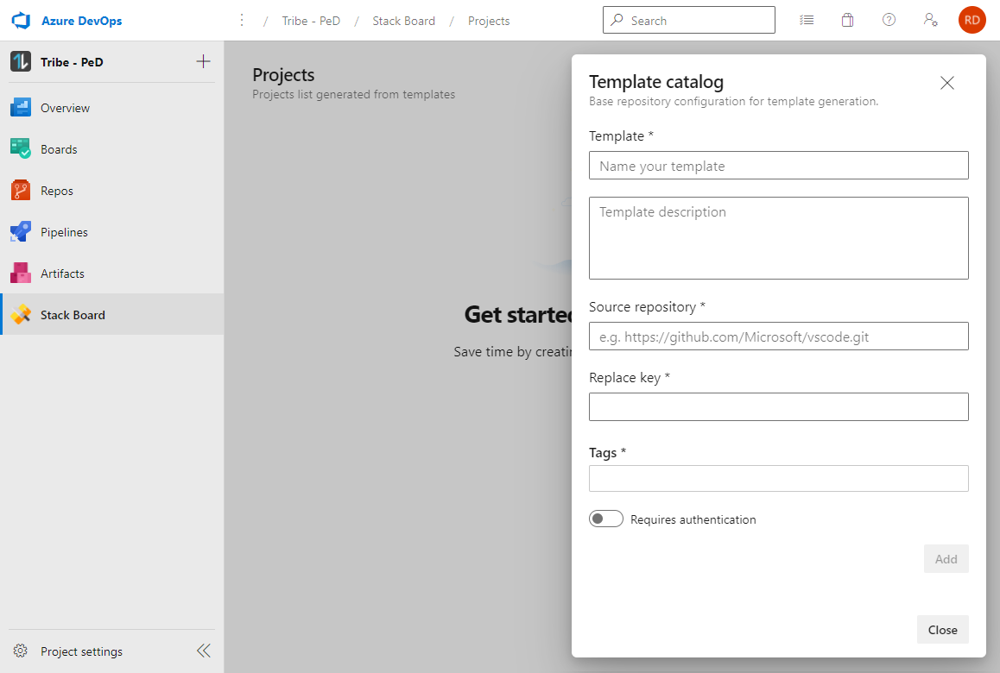
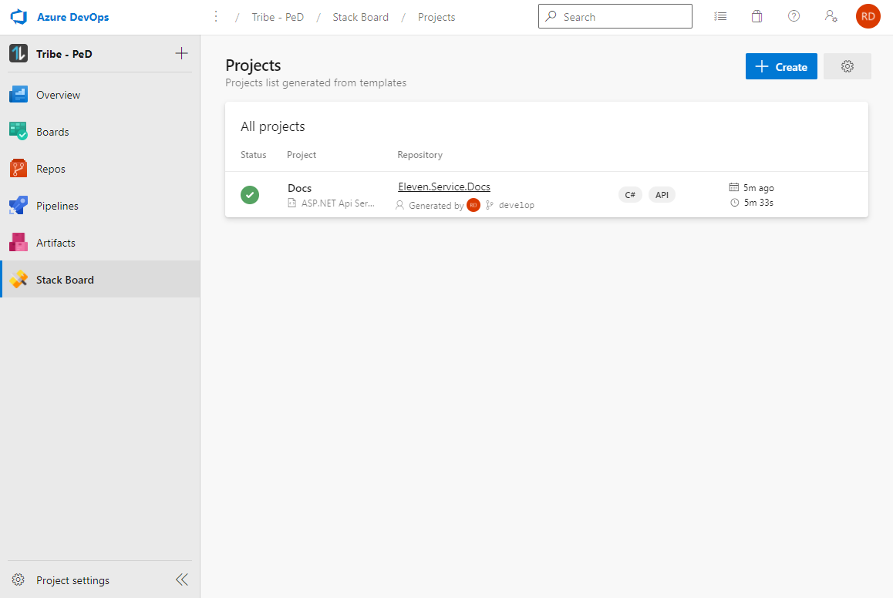

## **Stack Board for Azure DevOps**

Designed to speed up the start of new projects by development teams, Stack Board has a template-based process for creating repositories in Azure DevOps.

It is possible to define several source code models, thus delivering architecture standards and software best practices.

## **Features**

- Creating repositories based on templates.
- Creating Build and Release pipelines (Coming soon).
- Technology Radar (Coming soon).

### **Template Catalog**

| Name | Description |
|--|--|
| Template | Name of template. e.g. **ASP.NET Core Api Service** |
| Template Description | Description of the template. e.g. **Microservice Template for ASP.NET Core** |
| Source Repository* | Repository with source code that will serve as the basis for projects ASP.NET Core |
| Replace Key | The keyword that will be changed when creating the project, such as solution name, namespaces, etc.|
| Tags | Tags of technology, such as C#, API, SQLServer |
| Requires authentication| If the source of the base repository is private, it must have its credentials for the git clone |

* *Even for repositories within Azure DevOps itself, the **"Requires authentication"** field is mandatory to perform the process.

### **Create new project**

| Name | Description |
|--|--|
| Template | Template previously created in the settings screen |
| Name | Project name and word that will be used to replace files and contents |
| Repository Name | Name of the repository that will be created in Azure DevOps |

### **Running**

### **Successed**

### **Requirements**

- For the process of creating a project, we use Azure Pipelines to perform tasks with git commands, so the permission of the user **"Build Service"** in each **Team Project** must have the following options to **Allow**.

- Contribute
- Create branch
- Force push

## **License**

Licensed under the MIT license. More information can be found by viewing the license [here](azure/license.md).